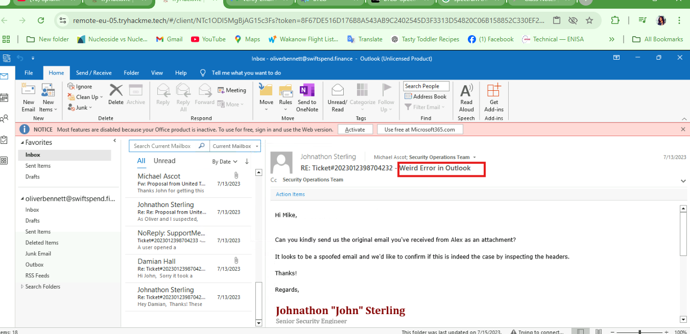

# Identification and scoping

### Identification and Scoping in  refers to the first phase of an Incident Response (IR) process. It focuses on detecting, analyzing, and defining the scope of a security incident before moving into containment and mitigation.

🔍 Key Concepts in Identification & Scoping
1️⃣ Identification 🕵️‍♀️

Detecting suspicious activity that may indicate an incident.

2️⃣ **Scoping** 📏

- Determining the **extent and impact** of the incident.
- Identifying **compromised systems, affected users, and attack vectors**.

This involves creating Organization Asset inventory  and creating Spread of Doom (SoD)

### Task:  Investigating an outlook email.

Just as you've joined us at **SwiftSpend Financial (SSF)**, we've already received notifications about a potential security compromise. There's no time to lose - we must promptly identify the nature of the breach and the scope of its extent!

**tryhackme room**

## **question 1:**

**What is the Subject of Ticket#2023012398704232?**

To answer that, i opened the email including the Ticket.

from the highlight the subject of the email is  **Weird Error in Outlook**

### Question 2:

According to your colleague John, the issue outlined on Ticket#2023012398704232 could be related to what?

Answer:

the answer to this task is SPF, DKIM & DMARC records

- **more info**
    
    ### 1️⃣ **SPF (Sender Policy Framework)**
    
    SPF helps prevent spammers from sending emails on behalf of your domain. It works by defining which mail servers are authorized to send emails for your domain.
    
    - SPF is implemented by adding a **TXT record** to your domain’s DNS.
    - When an email is received, the recipient’s mail server checks the SPF record to see if the sending server is authorized.
    - If the sender's IP is not listed in the SPF record, the email may be rejected or marked as spam.
    
    ### 2️⃣ **DKIM (DomainKeys Identified Mail)**
    
    DKIM ensures email integrity by adding a **digital signature** to outgoing emails. This helps the receiver verify that the email was not altered during transmission.
    
    - DKIM uses **public-key cryptography**.
    - A **private key** is used by the sender to sign the email.
    - A corresponding **public key** is published in the DNS as a TXT record.
    - The receiving mail server verifies the email's DKIM signature using the public key.
    
    ### 3️⃣ **DMARC (Domain-based Message Authentication, Reporting & Conformance)**
    
    DMARC builds on SPF and DKIM by adding a policy to specify how to handle unauthorized emails.
    
    - It helps prevent email spoofing and phishing attacks.
    - The policy can be set to **monitor**, **quarantine**, or **reject** suspicious emails.
    - DMARC also provides reports on authentication failures.

### Question 3:

Your colleague requested what kind of data pertaining to the machine WKSTN-02?

The web proxy logs were requested from the machine.

- **More details**
    
    ### **Web Proxy Logs: What They Do & Why They Matter**
    
    **Web proxy logs** capture and store records of all web traffic passing through a **proxy server**. These logs provide insights into user activity, security threats, and network performance.
    
    ---
    
    ### **🔍 What Do Web Proxy Logs Contain?**
    
    Each log entry typically includes:
    
    ✅ **Timestamp** – When the request was made.
    
    ✅ **Source IP** – The user or device making the request.
    
    ✅ **Destination URL/IP** – The website or server being accessed.
    
    ✅ **HTTP Method** – (GET, POST, PUT, DELETE) – Type of request.
    
    ✅ **Status Code** – (200, 403, 404, 500, etc.) – Response from the web server.
    
    ✅ **Bytes Transferred** – Amount of data sent/received.
    
    ✅ **User-Agent** – The browser or application used.
    
    ✅ **Referrer URL** – Where the request originated from.
    

### Question 4:

Based on Ticket#2023012398704231 and Asset Inventory shown in this task, who owns the computer that needs Endpoint Protection definitions updated?

Answer:

i decided to look at the ticket , there i  noted the affected hostname as seen Below:

Affected hostname shows  LPTP-O1 

From the  Asset Inventory, the endpoint which is a Laptop belongs to  Derick Marshall

LPTP-01 belongs to Derick Marshall who is the Head of information Technology - Operations and support.

### Question 5

Based on the email exchanges and SoD shown in this task, what was the phishing domain where the compromised credentials in Ticket#2023012398704232 were submitted?

Answer:

To solve this task, i had to open preview the attachment Michael Ascot forwarded to Jonathan as the as the email he received from Alex (which was obviously Spoofed)

The Spread sheet of Doom , [[b24b]-158-62-19-6.{ngrok}-free.app](https://b24b-158-62-19-6.ngrok-free.app/) 

### Question 6:

Based on Ticket#2023012398704233, what phishing domain should be added to the SoD?

Answer:

My approach was to view the ticket that was raised and yeah!!! i go my answer to the Task.

[kennaroads.{buzz](https://kennaroads.buzz/data/Update365/office365/40e7baa2f826a57fcf04e5202526f8bd/?email=zoe.duncan@swiftspend.finance&error)}

### Question 7

Concerning Ticket#2023012398704232 and according to your colleague John, what domain should be added to the SoD since it was used for email spoofing?

Answer:

I checked the email sent by Jonathan in response  to the ticket  indicated that the mail server thatb need to be added is emkei.cz.

  server posing as threat](image%207.png)

[Emkei.cz](http://Emkei.cz)  server posing as threat

### Question 8

Concerning the available artefacts gathered for analysis of Ticket#2023012398704232, who is the other user that received a similar phishing email but did not open a ticket nor report the issue?

Answer:

alexander.swift@swiftspend.finance

### Question 9

Concerning Ticket#2023012398704232, what additional IoC could be added to the SoD and be used as a pivot point for discovery?

Answer:

Damian sent an attachment containing the message logs and server logs. I had to open the message tracert logs.  and there was another IOC that should be added to  the SoD.

### Question 10

Based on the email exchanges and attachments in those exchanges, what is the password of the compromised user?

Answer:

i had to check the logs for the Post Request which shows about the input.

The Password used by michael while logging in is Passw0rd!

### My thoughts.

Michael fell for a phishing email, he was not using a strong password which can easily be bruteforced. for a robust incident response,  Michael’s workstation needs to be isolated and  investigated further.  The impact can be severe when the attacked have assess to  sensitive information by escalating privilege.

### Recommendation

proper staff training should be regular so as to educate employee about phishing scams.

##Thank You.
###Victoria Simon
